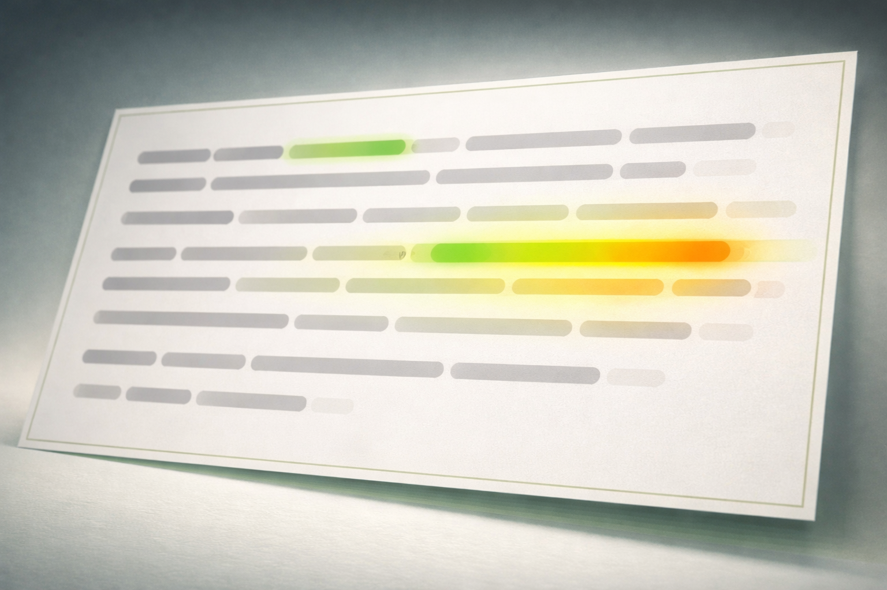
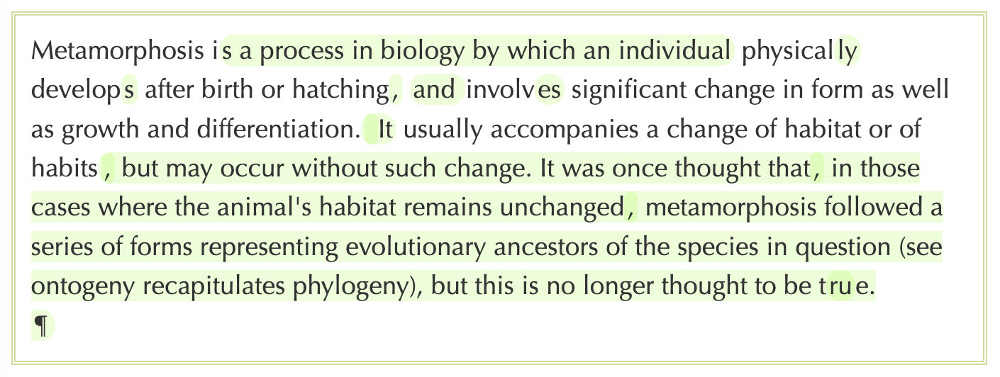

<div align="center">



# Deep Diffs

</div>

Visualise cumulative changes across multiple text revisions. Regions, words or characters that have been edited multiple times are highlighted with increasing intensity.



Unlike normal diff tools that compare two versions, `deep-diffs` can visualise where changes have been made in a document throughout multiple revisions over time — giving you a “heatmap” of editorial activity, particularly where details are being worked onor revised repeatedly.

## Use Cases

- **Legal document review** — see which clauses have been contentious across redlining rounds
- **Collaborative writing** — identify paragraphs that have already been finessed
- **Wikipedia-style editing** — spot edit-war hotspots
- **Code review** — find code blocks that have been tweaked repeatedly

## Installation

```bash
npm install @rossshannon/deep-diffs
```

## Quick Start

```javascript
import { deepDiffHtml, getDefaultStyles } from '@rossshannon/deep-diffs';

// A contract clause being refined over multiple revisions
const revisions = [
  'The client shall pay the invoice.',
  'The client shall pay the invoice within 30 days.',
  'The client shall pay the invoice in full within 30 days.',
  'The client shall pay the invoice in full within 30 business days.',
];

const html = deepDiffHtml(revisions);
const css = getDefaultStyles();
```

Output:
```html
The client shall pay the invoice<ins class="deep-diff"> <ins class="deep-diff">in full
</ins>within 30 <ins class="deep-diff">business </ins>days</ins>.
```

Notice the **nested `<ins>` tags** — “within 30 days” was added first, then “in full” was inserted inside that region, then “business” was added. The nesting depth indicates how many times a region has been edited. The default CSS styles these with increasing background intensity, creating a visual heatmap of editorial activity. After multiple rounds of editing, a richer picture of the editorial process emerges.

## API

### `computeDeepDiff(revisions, options?)`

Computes diff markers without rendering.

```javascript
import { computeDeepDiff } from '@rossshannon/deep-diffs';

const { text, markers } = computeDeepDiff(revisions);

// text: the final revision text
// markers: array of { start, end, enabled } marker objects
```

**Options:**
- `skipEmpty` (boolean, default `true`) — skip empty revisions (useful for filtering vandalism)
- `timeout` (number, default `1`) — diff computation timeout in seconds

### `renderWithMarkers(text, markers, options?)`

Renders text with markers as HTML.

```javascript
import { computeDeepDiff, renderWithMarkers } from '@rossshannon/deep-diffs';

const { text, markers } = computeDeepDiff(revisions);
const html = renderWithMarkers(text, markers, {
  tagName: 'mark',
  className: 'changed'
});
```

**Options:**
- `tagName` (string, default `'ins'`) — HTML tag for markers
- `className` (string, default `'deep-diff'`) — CSS class for tags

### `deepDiffHtml(revisions, options?)`

Convenience function combining `computeDeepDiff` and `renderWithMarkers`.

```javascript
import { deepDiffHtml } from '@rossshannon/deep-diffs';

const html = deepDiffHtml(revisions, { skipEmpty: true });
```

### `getDefaultStyles(maxDepth?)`

Generates CSS for nested marker intensity.

```javascript
import { getDefaultStyles } from '@rossshannon/deep-diffs';

const css = getDefaultStyles(5);
// Returns CSS with increasingly intense backgrounds for nested .deep-diff elements
```

## How It Works

1. **Chain diffs** — compute diffs between each consecutive revision pair
2. **Track markers** — maintain a list of changed regions with `[start, end]` positions
3. **Transform markers** — as new edits occur, existing markers shift, expand, or contract:
   - Insert before marker → shift right
   - Insert within marker → expand
   - Delete before marker → shift left
   - Delete within marker → contract (disable if fully subsumed)
4. **Accumulate** — new insertions add new markers; nesting depth = change frequency
5. **Render** — interleave tags at marker boundaries

This is essentially a simplified form of [operational transformation](https://en.wikipedia.org/wiki/Operational_transformation) — the same conceptual framework that powers real-time collaboration in Google Docs.

## Browser Usage

```html
<script type="module">
  import { deepDiffHtml, getDefaultStyles } from 'https://unpkg.com/@rossshannon/deep-diffs';

  const style = document.createElement('style');
  style.textContent = getDefaultStyles();
  document.head.appendChild(style);

  document.getElementById('output').innerHTML = deepDiffHtml(myRevisions);
</script>
```

## TypeScript

Full TypeScript support with bundled type definitions:

```typescript
import {
  deepDiffHtml,
  computeDeepDiff,
  type Marker,
  type DeepDiffResult
} from '@rossshannon/deep-diffs';

const result: DeepDiffResult = computeDeepDiff(['v1', 'v2', 'v3']);
console.log(result.text);           // string
console.log(result.markers);        // Marker[]

const html: string = deepDiffHtml(['v1', 'v2'], {
  tagName: 'mark',
  className: 'highlight'
});
```

## Limitations

- **Character-indexed markers** — This techique is tuned for tracking how details change in text over time. Large structural refactors (e.g., replacing or moving paragraphs) will lose some of the necessary context.
- **No move detection** — if text is cut and pasted elsewhere, it's treated as delete + insert, not a move.

## Prior Art & Inspiration

- [IBM History Flow](http://hint.fm/projects/historyflow/) — Wikipedia revision visualisation (author-coloured, not intensity-based)
- [diff-match-patch](https://github.com/google/diff-match-patch) — the underlying diff engine from Google Docs
- [GitLens heatmaps](https://gitlens.amod.io/) — file-level age visualisation (not cumulative change count)
- [Deep Diffs: Visually Exploring the History of a Document](https://rossshannon.com/publications/softcopies/Shannon2010DeepDiffs.pdf) — the original paper on this technique

## History

Original algorithm by [Ross Shannon](https://rossshannon.com) (2010). Modernised and published 2026.

## License

MIT
