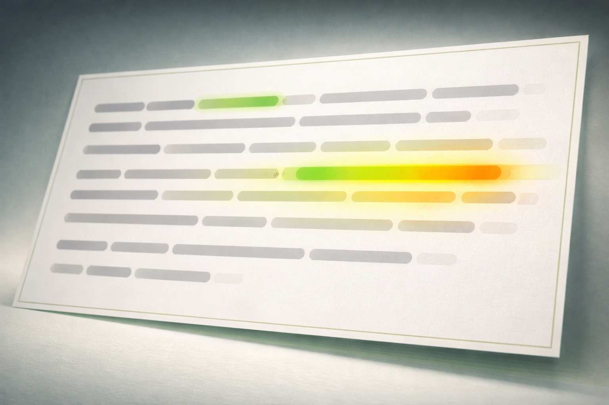
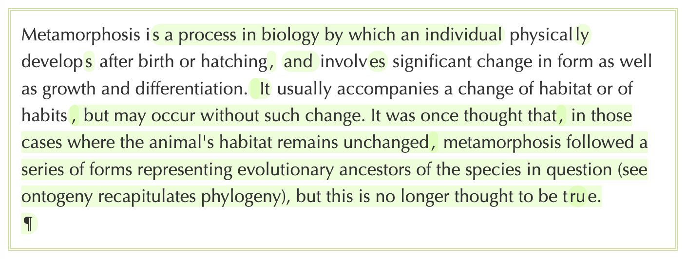
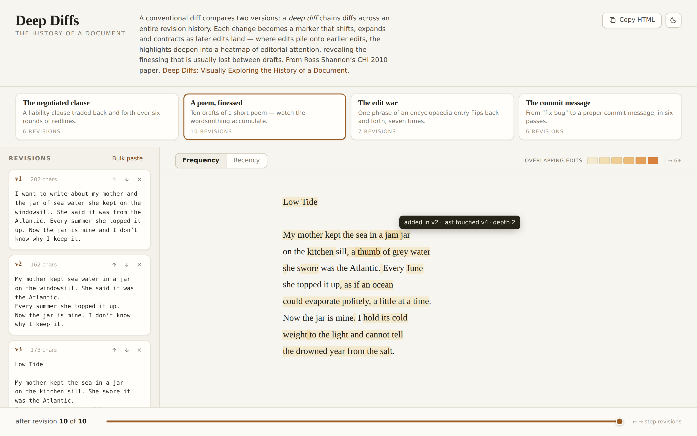
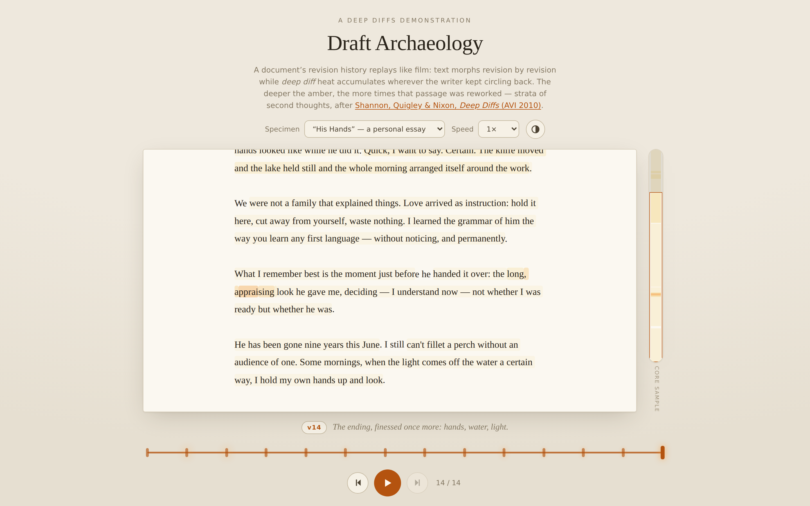
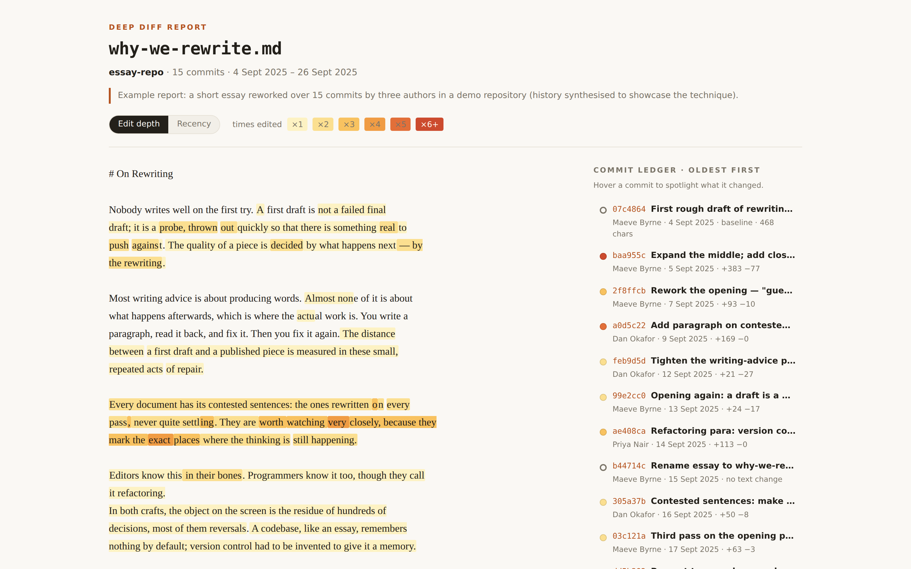

<div align="center">



# Deep Diffs

</div>

Visualise cumulative changes across multiple text revisions. Regions, words or characters that have been edited multiple times are highlighted with increasing intensity.



Unlike normal diff tools that compare two versions, `deep-diffs` can visualise where changes have been made in a document throughout multiple revisions over time — giving you a “heatmap” of editorial activity, particularly where details are being worked on or revised repeatedly.

## Demos

Eight interactive demos live in [`demos/`](demos/), with a gallery at [`demos/index.html`](demos/index.html). Each is a **self-contained single HTML file** — no build step, no network; just open it in a browser straight from `file://`.

| Demo | What it shows |
| --- | --- |
| [**Playground**](demos/playground.html) | The flagship. Editable revision cards, frequency & recency heat modes, a revision scrubber, hover tooltips (“added in v3 · last touched v6 · depth 2”), copy-as-HTML export, and four crafted sample histories. |
| [**Draft Archaeology**](demos/draft-archaeology.html) | A cinematic replay of a document being written — heat accumulates wherever the writer kept circling, with a “core sample” strata minimap. |
| [**The Living Draft**](demos/living-draft.html) | Deep diffs as ambient feedback while you type: auto-committing snapshots, plus an “embers” decay mode that shows *current* attention rather than accumulated strata. |
| [**Collaboration Lens**](demos/collab-lens.html) | Deep diffs × History Flow: three lenses over one document — heat (depth), author (who wrote it), consensus (who last touched contested ground). |
| [**Git Report**](demos/git-report.html) | An example report from the `deep-diffs-git` CLI: a 15-commit, three-author essay history rendered as a churn heatmap. |
| [**Polish vs Pivot**](demos/polish-vs-pivot.html) | Sentences threaded across revisions and scored for meaning drift, classifying each as Settled / Polished / Pivoted / Contested — was the writer refining the wording, or changing their mind? |
| [**ProseMirror Editor**](demos/prosemirror.html) | A real editor plugin ([`integrations/prosemirror/`](integrations/prosemirror/)) where ProseMirror’s `tr.mapping` performs the marker transform natively; pause-based snapshots, depth/recency heat. |
| [**Wiki Report**](demos/wiki-report.html) | Generated by the `deep-diffs-wiki` CLI from the live revision history of Wikipedia’s “Ship of Theseus” — 2,150 revisions by 1,268 contributors, an article that enacts its own paradox. |



<p align="center">
  
  
</p>

## Use Cases

- **Legal document review** — see which clauses have been contentious across redlining rounds
- **Collaborative writing** — identify paragraphs that have already been finessed
- **Wikipedia-style editing** — spot edit-war hotspots
- **Code review** — find code blocks that have been tweaked repeatedly

## Installation

```bash
npm install @rossshannon/deep-diffs
```

## Quick Start

```javascript
import { deepDiffHtml, getDefaultStyles } from '@rossshannon/deep-diffs';

// A contract clause being refined over multiple revisions
const revisions = [
  'The client shall pay the invoice.',
  'The client shall pay the invoice within 30 days.',
  'The client shall pay the invoice in full within 30 days.',
  'The client shall pay the invoice in full within 30 business days.',
];

const html = deepDiffHtml(revisions);
const css = getDefaultStyles();
```

Output:
```html
The client shall pay the invoice<ins class="deep-diff"> <ins class="deep-diff">in full </ins>within 30 <ins class="deep-diff">business </ins>days</ins>.
```

Notice the **nested `<ins>` tags** — “within 30 days” was added first, then “in full” was inserted inside that region, then “business” was added. The nesting depth indicates how many times a region has been edited. The default CSS styles these with increasing background intensity, creating a visual heatmap of editorial activity.

If you want the raw data instead, `computeDeepDiff` gives you the final text plus markers that each know their history:

```javascript
import { computeDeepDiff } from '@rossshannon/deep-diffs';

const { text, markers, revisionCount } = computeDeepDiff(revisions);
// revisionCount → 4
// markers[0]    → { start: 32, end: 63, enabled: true, revision: 1, lastTouched: 3 }
```

Each marker records the `revision` that created it (1-based) and the `lastTouched` revision that most recently modified the region — the raw material for recency views, author attribution and tooltips.

## API

### `computeDeepDiff(revisions, options?)`

Computes diff markers without rendering. Returns `{ text, markers, revisionCount }` — plus `deletions` when tombstone tracking is on.

**Options:**
- `skipEmpty` (boolean, default `true`) — skip empty revisions (useful for filtering vandalism)
- `timeout` (number, default `1`) — diff computation timeout in seconds
- `trackDeletions` (boolean, default `false`) — record a tombstone for every deletion (below)
- `normalize` (boolean or `{ joinGap }`, default `false`) — merge fragmented same-revision markers (see `normalizeMarkers`)
- `trackReplacements` (boolean, default `false`) — treat an adjacent delete+insert pair as a replacement (below)

**Deletion tombstones.** With `trackDeletions: true`, every deletion becomes a zero-width tombstone `{ index, text, revision }` in final-text coordinates (`index` is a point between characters; `revision` is the revision that deleted it). Tombstone positions are transformed through all later revisions, and a tombstone stays put when text is later inserted at its position — so replacements read chronologically: old text’s ghost first, then its replacement.

```javascript
const { text, markers, deletions } =
  computeDeepDiff(['the cat sat', 'the dog sat'], { trackDeletions: true });
// deletions → [{ index: 4, text: 'cat', revision: 1 }]

renderWithMarkers(text, markers, { renderDeletions: deletions });
// the <del class="deep-diff-ghost">cat</del><ins class="deep-diff">dog</ins> sat
```

**Replacements.** With `trackReplacements: true`, an adjacent delete+insert pair is treated as a replacement: markers overlapping the deleted range are remapped proportionally onto the inserted text instead of being killed, so deleting a phrase and retyping it deepens heat rather than resetting it. Marker identity is preserved (`revision` stays the birth revision). Recommended for fine-grained, keystroke-level histories; leave off for coarse committed revisions.

```javascript
const { markers } = computeDeepDiff(
  ['the quick fox', 'the slow fox', 'the sluggish fox'], { trackReplacements: true });
// markers → two overlapping markers on "sluggish" (born rev 1, rev 2) instead of one fresh marker
```

### `renderWithMarkers(text, markers, options?)`

Renders text with markers as nested HTML tags.

**Options:**
- `tagName` (string, default `'ins'`) — HTML tag for markers
- `className` (string, default `'deep-diff'`) — CSS class for tags
- `dataAttributes` (boolean, default `false`) — emit `data-revision`, `data-last-touched` and `data-depth` on every tag, using a stack-based renderer that attributes each character to the correct marker
- `boundary` (`'char'` | `'word'`, default `'char'`) — with `'word'`, marker edges are snapped outward to word boundaries so highlights read as whole words (render-only; your markers array is never mutated)
- `renderDeletions` (Tombstone[]) — interleave deleted text as `<del class="deep-diff-ghost">…</del>` ghosts at their tombstone positions

```javascript
renderWithMarkers('hello world', [{ start: 7, end: 8, enabled: true }], { boundary: 'word' });
// hello <ins class="deep-diff">world</ins>

renderWithMarkers(text, markers, { dataAttributes: true });
// <ins class="deep-diff" data-revision="2" data-last-touched="2" data-depth="2">in full </ins>…
```

### `computeHeatSegments(text, markers)`

Flattens any overlap structure into non-overlapping segments that tile the whole text — the canonical input for canvas minimaps and heat strips. Note that segments use **half-open ranges** (`end` is *exclusive*), unlike markers, whose `end` is inclusive.

```javascript
computeHeatSegments(text, markers);
// [ { start: 0,  end: 32, depth: 0, revision: 0, lastTouched: 0 },
//   { start: 32, end: 33, depth: 1, revision: 1, lastTouched: 3 },
//   { start: 33, end: 41, depth: 2, revision: 2, lastTouched: 3 },
//   … ]
```

`depth` is the number of covering markers (0 for unmarked stretches); `revision`/`lastTouched` are the maxima among covering markers.

### `normalizeMarkers(markers, { joinGap = 0 })`

Diff cleanup can fragment one conceptual edit into several small markers. This merges markers **born in the same revision** that overlap or sit within `joinGap` unmarked characters of each other. Markers from different revisions are *never* merged — cross-revision stacking **is** the depth signal. Returns a new sorted array; the input is not mutated.

```javascript
normalizeMarkers([
  { start: 0, end: 2, enabled: true, revision: 1, lastTouched: 1 },
  { start: 4, end: 6, enabled: true, revision: 1, lastTouched: 1 },
  { start: 4, end: 6, enabled: true, revision: 2, lastTouched: 2 },
], { joinGap: 1 });
// → the two revision-1 markers merge into { start: 0, end: 6, … };
//   the revision-2 marker is left alone.
```

`computeDeepDiff`’s `normalize` option applies this once after all revisions are processed.

### `deepDiffHtml(revisions, options?)`

Convenience function combining `computeDeepDiff` and `renderWithMarkers`; accepts both sets of options. As an extra convenience, `renderDeletions: true` automatically enables `trackDeletions` and pipes the tombstones through:

```javascript
deepDiffHtml(['the cat sat', 'the dog sat'], { renderDeletions: true });
// the <del class="deep-diff-ghost">cat</del><ins class="deep-diff">dog</ins> sat
```

### `getDefaultStyles(options?)`

Generates CSS for nested marker intensity, including the `.deep-diff-ghost` deletion style. The legacy call `getDefaultStyles(maxDepth)` still works; the options-object form adds:

- `maxDepth` (default `5`) — deepest nesting level to style
- `palette` — `'green'` (default), `'amber'`, `'ocean'` or `'heat'`: hand-tuned colour ramps that keep text readable at high intensity
- `darkMode` (default `false`) — also emit a `@media (prefers-color-scheme: dark)` block plus `[data-theme="dark"]` overrides, using ramps designed for dark backgrounds

```javascript
getDefaultStyles({ maxDepth: 6, palette: 'heat', darkMode: true });
```

## `deep-diffs-git` — churn reports from git history

The package ships a CLI that turns any file’s git history into a self-contained deep-diff HTML report — the technique applied to READMEs, docs, ADRs and blog posts.

```bash
npx deep-diffs-git README.md                    # writes README.md.deep-diff.html
deep-diffs-git essay.md --since 2025-01-01 --mode age --open
```

**Options:** `--out <path>`, `--max-revisions <n>` (default 30; longer histories are evenly sampled, always keeping first and last), `--since <date>`, `--mode <depth|age>` (initial heat mode), `--note <text>`, `--open`.

The report contains the document rendered as a depth-classed heatmap with two toggleable heat modes (edit depth and recency), a commit ledger with per-revision churn dots, and a legend. Renames are followed via `git log --follow`; binary/empty revisions are skipped with a warning. See [`demos/git-report.html`](demos/git-report.html) for an example.

## `deep-diffs-wiki` — churn reports from Wikipedia history

A sibling CLI that does the same for any Wikipedia article, live.

```bash
npx deep-diffs-wiki "<article title>" [--lang en] [--max-revisions 30] [--mode depth|age|authors] [--out report.html]
```

Revisions are fetched live from the MediaWiki Action API (rate-limit friendly, redirect-aware, approximate wikitext stripping), and rendered as the same report `deep-diffs-git` produces, plus an authors lens colouring highlights by each region’s original contributor. See [`demos/wiki-report.html`](demos/wiki-report.html) for a generated example.

## How It Works

1. **Chain diffs** — compute diffs between each consecutive revision pair
2. **Track markers** — maintain a list of changed regions with `[start, end]` positions
3. **Transform markers** — as new edits occur, existing markers shift, expand, or contract:
   - Insert before marker → shift right
   - Insert within marker → expand
   - Delete before marker → shift left
   - Delete within marker → contract (disable if fully subsumed)
4. **Accumulate** — new insertions add new markers; nesting depth = change frequency
5. **Render** — interleave tags at marker boundaries

This is essentially a simplified form of [operational transformation](https://en.wikipedia.org/wiki/Operational_transformation) — the same conceptual framework that powers real-time collaboration in Google Docs.

## Robustness

The marker transform is verified by an adversarial property-based suite ([`test/property.test.js`](test/property.test.js)) that replays the same diff-match-patch edit scripts through an **independent character-identity reference model**, giving exact ground truth for what a correct transform must cover. Over **60,000 fuzzed revision chains** (plain, unicode/astral, and pathological — same-spot edit storms, whole-text replacement) ran with zero invariant failures: the transform behaves as an exact operational transform. The fuzzing did find peripheral bugs — notably markers splitting UTF-16 surrogate pairs, now fixed with code-point snapping at marker edges — and marker ordering is now deterministic (`(start, end, revision)`). The full ledger, including diagnoses, lives in [docs/known-issues.md](docs/known-issues.md).

## Browser Usage

```html
<script type="module">
  import { deepDiffHtml, getDefaultStyles } from 'https://unpkg.com/@rossshannon/deep-diffs';

  const style = document.createElement('style');
  style.textContent = getDefaultStyles();
  document.head.appendChild(style);

  document.getElementById('output').innerHTML = deepDiffHtml(myRevisions);
</script>
```

## TypeScript

Full TypeScript support with bundled type definitions:

```typescript
import {
  computeDeepDiff,
  type Marker,
  type Tombstone,
  type HeatSegment,
  type DeepDiffResult
} from '@rossshannon/deep-diffs';

const result: DeepDiffResult = computeDeepDiff(['v1', 'v2', 'v3'], { trackDeletions: true });
result.markers;       // Marker[] — with revision & lastTouched
result.revisionCount; // number
result.deletions;     // Tombstone[] | undefined
```

## Limitations

- **Character-indexed markers** — this technique is tuned for tracking how details change in text over time. Large structural refactors (e.g., replacing or moving paragraphs) will lose some of the necessary context.
- **No move detection** — if text is cut and pasted elsewhere, it’s treated as delete + insert, not a move.
- **Tombstone text and surrogate pairs** — marker *positions* never split a surrogate pair, but when a replacement splits an emoji, a deletion tombstone’s `text` can carry a lone surrogate half; ghosts render it escaped, so output stays well-formed HTML.

## Where this goes next

[docs/FUTURE-DIRECTIONS.md](docs/FUTURE-DIRECTIONS.md) maps out where Deep Diffs goes in 2026, when documents are collaborative-by-default and increasingly flooded with machine-generated text. Nearest-term: ProseMirror/CodeMirror decoration plugins (a working ProseMirror integration now exists in [`integrations/prosemirror/`](integrations/prosemirror/)) and **CRDT-native markers** from Yjs/Automerge histories (exact provenance, no diff ambiguity). The big bet: deep diffs as a **provenance lens for AI co-writing** — heat marks what the human actually finessed; cold spans mark accepted-verbatim machine text. Plus recency “embers” decay (prototyped in the Living Draft demo), block-identity tracking to survive moves, and a set of testable hypotheses the 2010 note never evaluated.

## Prior Art & Inspiration

- [IBM History Flow](http://hint.fm/projects/historyflow/) — Wikipedia revision visualisation (author-coloured, not intensity-based)
- [diff-match-patch](https://github.com/google/diff-match-patch) — the underlying diff engine from Google Docs
- [GitLens heatmaps](https://gitlens.amod.io/) — file-level age visualisation (not cumulative change count)
- [Deep Diffs: Visually Exploring the History of a Document](https://rossshannon.com/publications/softcopies/Shannon2010DeepDiffs.pdf) — the original paper on this technique (Shannon, Quigley & Nixon, AVI 2010)

## History

Original algorithm by [Ross Shannon](https://rossshannon.com) (2010). Modernised and published 2026.

## License

MIT
